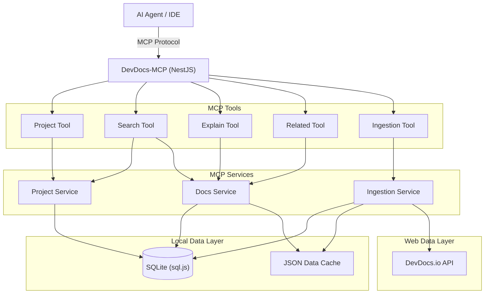

# System Architecture

DevDocs-MCP is built with **NestJS** and **TypeScript**, serving as a local MCP endpoint. It follows an offline-first architecture to maximize speed and reliability for AI agents.

## 🏗️ High-Level Components


## 🔄 Data Flow

1.  **Ingestion (Lazy/On-Demand)**:
    -   When an agent requests documentation for a package (e.g., `react`), `IngestionService` checks the local SQLite database for existing records.
    -   If missing:
        1.  It fetches metadata from `devdocs.io/docs/docs.json`.
        2.  It downloads the corresponding `index.json` (structure) and `db.json` (content).
        3.  Parsed entries are stored in SQLite (`doc_entries`).
        4.  Raw content is cached in the local filesystem as a JSON file.

2.  **Search**:
    -   Agent calls the `search` tool.
    -   `SearchTool` queries SQLite using tokenized fuzzy matching on titles and keywords.
    -   Results are ranked and returned with relevance scores.

3.  **Retrieval**:
    -   Agent calls `explain`.
    -   `DocsService` reads the content directly from the local JSON cache using O(1) slug lookup.
    -   HTML content is returned to the agent.

## 🗄️ Database Schema (SQLite)

The system uses `sql.js` (a pure JavaScript SQLite port) for persistent metadata to **avoid native C++ build dependencies**.

```sql
-- Projects: Tracks agent workspaces to pin versions
CREATE TABLE projects (
  id TEXT PRIMARY KEY,
  name TEXT,
  path TEXT,
  deps_json TEXT -- JSON map of { "pkg": "version" }
);

-- Doc Sources: Downloaded documentation sets
CREATE TABLE doc_sources (
  id TEXT PRIMARY KEY, -- e.g., "react@18.2.0"
  name TEXT,
  version TEXT,
  path TEXT, -- Local filesystem path to the JSON cache
  is_downloaded INTEGER DEFAULT 0
);

-- Doc Entries: Indexed searchable items
CREATE TABLE doc_entries (
  id TEXT PRIMARY KEY, -- e.g., "react@18.2.0:hooks/use-effect"
  source_id TEXT,
  title TEXT,
  slug TEXT, -- Internal DevDocs slug
  keywords TEXT, -- Space-separated tokens for search
  FOREIGN KEY(source_id) REFERENCES doc_sources(id)
);
```

## 🛠️ Implementation Notes: Why `sql.js`?

I deliberately chose `sql.js` over `better-sqlite3` to ensure the project remains **Node-only**. This eliminates the requirement for Python or C++ compilers during `pnpm install`, making it easily portable across Windows, macOS, and Linux without native build errors.

## 🔮 Roadmap: Future Updates to be Planned

I plan to implement a multi-phase update strategy:
-   **Phase 1**: Track documentation staleness by comparing local `mtime` with the DevDocs catalog.
-   **Phase 2**: Add a `check_updates` tool to notify agents when newer docs are available.
-   **Phase 3**: Background refreshes for mission-critical documentation packages.

