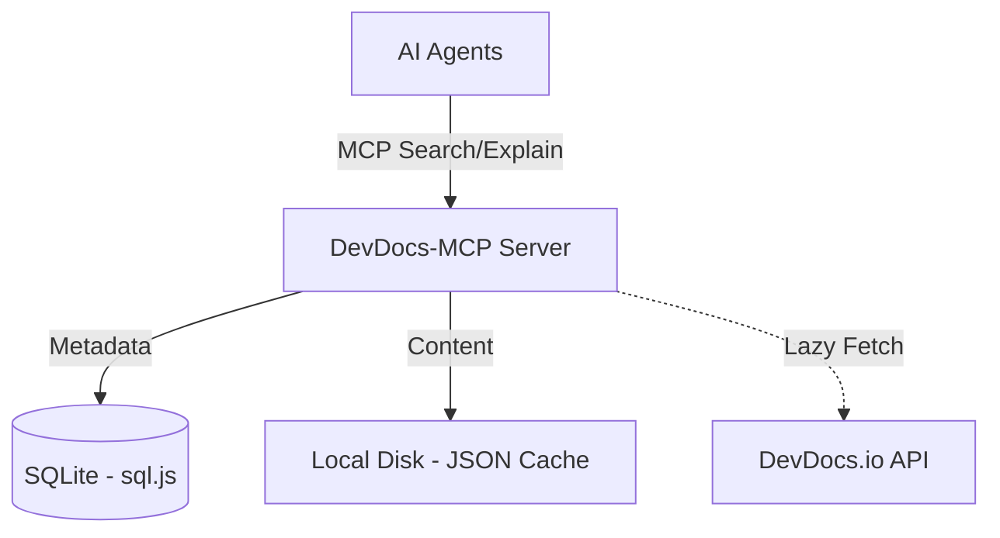

# DevDocs-MCP:  Documentation Authority for AI Agents

> **Eliminate AI hallucinations with local, version-aware, and authoritative documentation.**

  DevDocs-MCP is a Model Context Protocol (MCP) server that provides version-pinned, deterministic documentation sourced from [DevDocs.io](https://devdocs.io) to AI assistants (Claude, RooCode, Cline, Copilot etc.). It acts as a local Documentation Intelligence Layer, ensuring your agent always has the correct API context without network latency or training data drift. 

  This server follows the proposed MCP server standard defined by the [MCP](https://modelcontextprotocol.io/docs/getting-started/intro) , which is being adopted by AI tools and agents across the ecosystem, including those from providers such as Anthropic, OpenAI, and Google.

---

> ⚠️ **Project Status Notice** ⚠️
> This project is under active and heavy development. Still need to test existing features and implement more new features like optimal caching , update latest doc automatically and also on request basis , optimal querying and more... Design decisions, APIs, and structure are expected to evolve based on strong opinions, reviews, and feedback from the developer community. I warmly welcome discussions, critiques, and contributions to help shape this project in the right direction.

---

## 📑 Table of Contents

1. [Overview](#-overview)
2. [Key Capabilities](#-key-capabilities)
3. [Quickstart](#-quickstart)
4. [Installation & Setup](#-installation--setup)
5. [AI Agent Configuration](#-ai-agent-configuration)
6. [Further Reading](#-further-reading)

---

## 🎯 Overview

<details>
<summary><b>What This Project Is</b></summary>

- A **local MCP server** written in NestJS (TypeScript).
- A **deterministic authority** for documentation metadata and content.
- A **lazy-ingestion engine** that caches DevDocs offline.
- A **project-aware context manager** that pins docs to your `package.json` versions.

</details>

<details>
<summary><b>What This Project Is NOT</b></summary>

- ❌ An AI agent or code generator.
- ❌ A web scraper (it uses structured DevDocs datasets).
- ❌ A DevDocs UI replacement.
- ❌ A hosted SaaS (it runs 100% locally).

</details>

<details>
<summary><b>Why This Exists (The Problem)</b></summary>

Modern AI coding agents face three major hurdles:

1. **Hallucination**: Guessing API signatures or using deprecated methods.
2. **Latency**: Fetching live web docs for every query is slow.
3. **Version Drift**: Mixing up React 18 with React 19 features.

**The Solution**: DevDocs-MCP provides "Just-in-Time" documentation retrieved from local storage, filtered by your project's specific dependency versions.
</details>

<details>
<summary><b>Mental Model</b></summary>

DevDocs-MCP acts as a middleware between your IDE Agent and the documentation source.



</details>

---

## 🚀 Key Capabilities

- **Offline-First**: Documentation is cached locally; no internet is needed after ingestion.
- **Ranked Fuzzy Search**: Instantly find relevant entries (e.g., "intersection observer").
- **Version Awareness**: Automatically maps to specific library versions in your project.
- **Node-Only Architecture**: Uses `sql.js` for zero-native dependencies (no Python/C++ build steps).
- **Structured Outputs**: Returns clean, LLM-optimized content.

---

## ⚡ Quickstart

1. **Clone & Install**

  ```bash
  git clone https://github.com/madhan-g-p/DevDocs-MCP.git
  cd DevDocs-MCP
  pnpm install
  ```

2. **Configure Environment**

  ```bash
  cp .env.example .env
  # Edit .env: Set DEVDOCS_DATA_PATH to where you want to store docs.
  ```

3. **Build & Run**

  ```bash
  pnpm build
  pnpm start:prod
  ```

> **Note:** Strictly use `pnpm` for development and contributions.

---

## 🛠️ Installation & Setup

DevDocs-MCP is optimized for zero-fuss setup with `pnpm`. It is a **Node-only** project.

### Prerequisites

- Node.js 18+ (tested on 18.x and 20.x).

### 🐳 Docker Usage

Each user's documentation data is persistent and stored locally on their machine.

1.  **Run the Server (SSE Mode)**:
    ```bash
    docker run -d -p 3000:3000 \
      -v "$(pwd)/data:/app/data" \
      -e PORT=3000 \
      madhandock1/devdocs-mcp:latest
    ```
    *This maps your local `./data` folder to the container, ensuring your downloaded docs are saved.*

2.  **Configure Agent**:
    - **SSE URL**: `http://localhost:3000/mcp/sse`

### Configuration (`.env`)

| Variable | Description | Default |
| :--- | :--- | :--- |
| `DEVDOCS_DATA_PATH` | Path to store downloaded documentation JSONs. | `./data` |
| `MCP_DB_PATH` | Path to the SQLite metadata database. | `mcp.db` |
| `LOG_LEVEL` | Verbosity (debug, info, warn, error). | `info` |

### Ingesting Documentation

Once the server is connected to your agent, use the `ingest` tool to download documentation for your specific stack:
Agent will take care of it once the server is up and running , it is supposed to list the available to tools and take decision accordingly.

```json
{
  "dependencies": {
    "react": "18.2.0",
    "typescript": "5.0.0"
  }
}
```
>Note: The Devdocs fetch url required to be used for ingestion is defined in `src/config/constants.ts`. This URL currently points to the correct and officially supported path. If the [devdocs](https://github.com/freecodecamp/devdocs) community changes this path in future, the configuration may need to be updated accordingly.<br/>
This approach does not involve web scraping. It follows the same supported mechanism used by DevDocs to provide documentation for [offline use](https://devdocs.io/settings), similar to how users download documentation within DevDocs itself.

---

## 🤖 AI Agent Configuration

### RooCode / Cline / Claude Desktop (Recommended: STDIO)

Add this to your `mcp_settings.json`. By setting the `cwd` (Current Working Directory), the server will automatically load configuration from your `.env` file, allowing you to use relative paths for data storage.

```json
{
  "mcpServers": {
    "devdocs": {
      "command": "node",
      "args": ["dist/main.js"],
      "cwd": "file://path/to/your/DevDocs-MCP"
    }
  }
}
```

> **Pro Tip**: Use the absolute path to the project in `cwd`. The server will then find your `.env` and use the `DEVDOCS_DATA_PATH` and `MCP_DB_PATH` you've defined there (e.g., `./data` or `mcp.db`), making the setup portable!

### Remote / Web Clients (HTTP SSE)

If you need to expose the server via a port (for production/remote setups):

1. **Start the server with a port flag**:
   ```bash
   node dist/main.js --port 3000
   ```
2. **Configure your client**:
   - **SSE URL**: `http://your-server:3000/mcp/sse`
   - **Type**: `SSE` (Supported by most MCP clients, atleast I guess so)

---

## 📖 Further Reading

- [**System Architecture**](ARCHITECTURE.md): Deep dive into the data flow, schema, and `sql.js` internals.
- [**Contributor Guidelines**](CONTRIBUTING.md): Workflow, coding standards, and PR requirements.
- [**LICENSE**](LICENSE): MIT License.

---
*Inspired from this project [devdocs-local](https://github.com/whiteinge/dotfiles/blob/master/bin/devdocs-local) ,
[devdocs-local-demo](https://eseth.org/2020/devdocs-cli.html) by [@Nathaniel Whiteinge](https://github.com/whiteinge)*
